T3A2 - PART A
---------------------------------------------------------------------------------------------------------

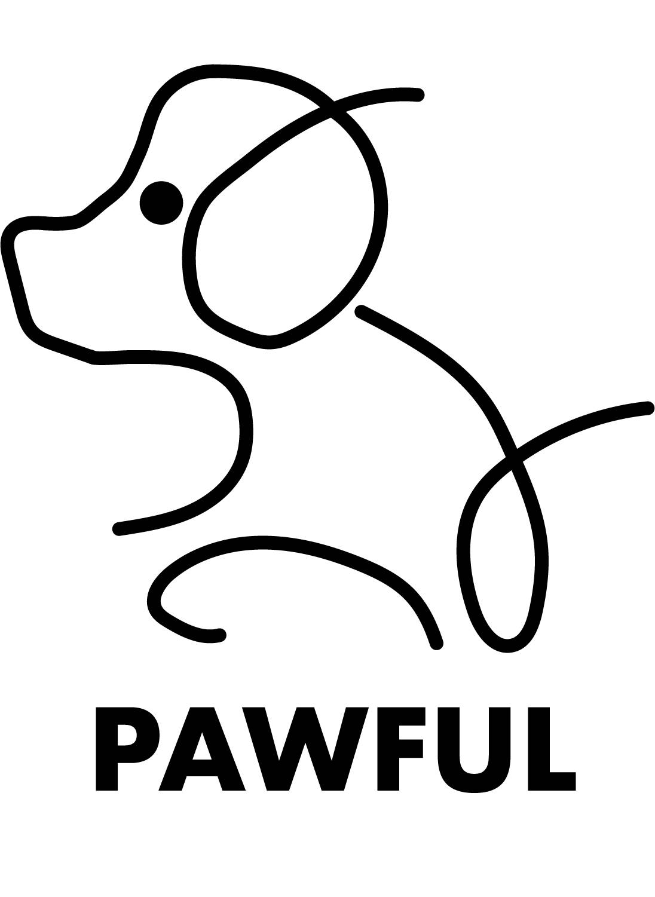

**PAWFUL web application**
**(Planning & Documentation Phase)**
---------------------------------------------------------------------------------------------------------

---------------------------------------------------------------------------------------------------------

**Group**
---------
Our Small Group of Full Stack Web Developers were able to work together to create this MERN stack application in just 3 weeks called 'Pawful'. We are a group of 3 students from the Coder Academy in Brisbane, Australia. We are all passionate about creating applications which are user friendly with engaging and responsive UI. We are all very excited to be able to showcase our skills and knowledge through this project, enjoy!

 

- [**Jordyn Small**](https://github.com/JanzenCode)
- [**Joshua Doig**](https://github.com/doigiee)
- [**Ryan Chang-Ha Lee**](https://github.com/RyanWoolf)

---------------------------------------------------------------------------------------------------------

**Purpose**
-----------
The purpose of this app is to enable anyone with a dog the convenience of booking grooming and/or pet playground (daycare) services with ease. Enabling users to easily set up a date and time to have their dog(s) groomed and "dog-sat" with other user members' dogs, supervised by professional staff. We've also made it possible for users to easily delete or update their bookings if they have a change of plans, thus adding to the ease of use.

---------------------------------------------------------------------------------------------------------

**Target audience**
-----------

Anyone looking for a dog playground with pet services such as grooming and bath. 
- Most likely people who work 9-5 jobs and don't have the means of caring for their dogs while at work. 
- OR for those wishing to give their companions 5 star dog care.
- OR those unable to groom, wash, clean their dogs themselves for whatever reason that may be.

---------------------------------------------------------------------------------------------------------

**Features**
-----------
Our app comes with many features, some of which include:

1. SPA (single-page-application) powered by React.js

- Nav bar (Hamburger menu)
  i. About us / Services / Inquiry / Sign in / Join
- Landing page
  i. Short greetings with 2 buttons
    - Our services
    - Make a booking
- About us page
  i. playground and location information
- Services page
  i. Services list
  ii. Package list
  iii. Customers can make a booking through here
- Send an inquiry
- Sign in page (modal)
  i. Redirect to the landing page
- Join page
  i. Email Verification
  ii. Member detail
    - Email
    - Title
    - First name
    - Last name
    - Contact
    - Address/City
iii. Dog's details
    - Name
    - Sex
    - Breed
    - Age
    - (Any text based additional information)
iiii. After register, welcome message then redirect to the landing page

2. Database powered by MongoDB, Node.js, Express.js
  - Sign in /Join 
    i. CRUD
    ii. RegEx for email / password
  - Booking a service / Check bookings
    i. CRUD
  - Inquiries
    i. Using HTML form to send email
    ii. The log can be added into the database
---------------------------------------------------------------------------------------------------------

**Tech stack**
-----------

The tech stack for this project was numerous though common for this type of project. We used Canva for designing our logo and website mockups, Figma for designing our wireframes, MongoDB to store user information and operate on these storages through CRUD functions, Netlify to publish our work on the web, Railway to create a live server, Git and Github for source control, Trello board & Kanban project methodology to help visualise and assign our abstract projects sections and finally HTML, CSS, JavaScript, React, Express.js, Node.js to make our website functional, interactive and visual.

 

 

1. **Design**
  - Canva
  - Photoshop / illustrator
  - Figma
2. **Frontend**
  - HTML
  - CSS
  - JavaScript
  - React
3. **Backend**
  - JavaScript
  - Express.js
  - Node.js
  - MongoDB
4. **Server hosting**
  - Netlify
  - Railway
5. **Version control**
  - Git
  - Github
6. **Project management**
  - Kanban
  - Trello

---------------------------------------------------------------------------------------------------------

**Application Architecture Diagram**
-----------

Fairly self explainatory through to give a quick run through of the diagram (right-to-left): MongoDB is the database which stores all the user information and uses CRUD functions which are performed on these stored data. Express.js is the framework that allows us to use Node.js to create a server and host our website on the web. React.js is the framework which allows us to create a single page application that is interactive and responsive. Finally, we use HTML, CSS and JavaScript to create the frontend of our website.

Basically, the diagram illustrates how users will make a query to the database and the process our application and servers go through to give a response back to users. Firstly, the user interacts with the application through the UI/frontend, the frontend sends the request to the backend. The backend then sends the request to the database, the database then sends the data back to the backend, the backend then sends the data back to the frontend. Finally, the frontend then displays the resulting data for users.

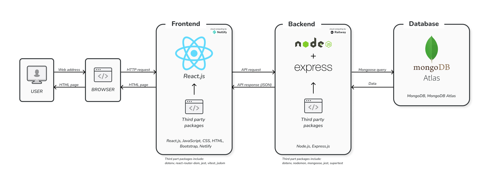

---------------------------------------------------------------------------------------------------------

**Dataflow Diagram**
-----------

Used to show the flow of data through the application, how these sections of our app connect, the stages in which users will go through to get a result and what outcomes can occur throughout these stages/processes. Some main areas of dataflow include: CRUD, SignUp, login, MongoDB pet database storage, state, verification, error handling, admin privileges, queries and so on.

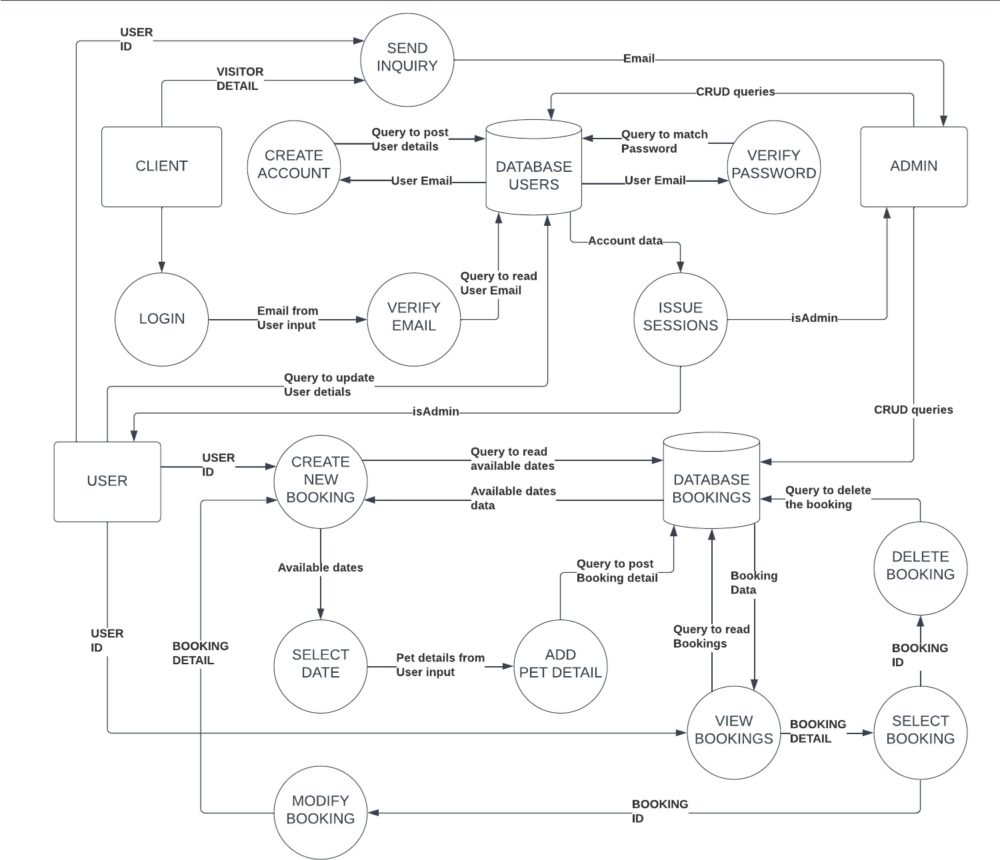

---------------------------------------------------------------------------------------------------------

**User Stories-**
-----------

Below are just a few anecdotes of user stories which demonstrates the purpose of our website, variety of our target audience, that we are aiming to reach, and meaningful implications of our application.

**User Persona 1 - Sandra Smalls (Business Woman)**
-----------

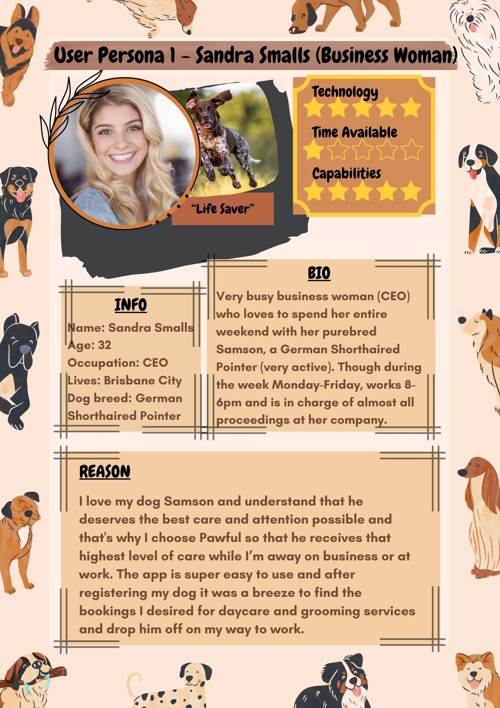

**User Persona 2 - Julia Caesar (Retired Senior)**
-----------

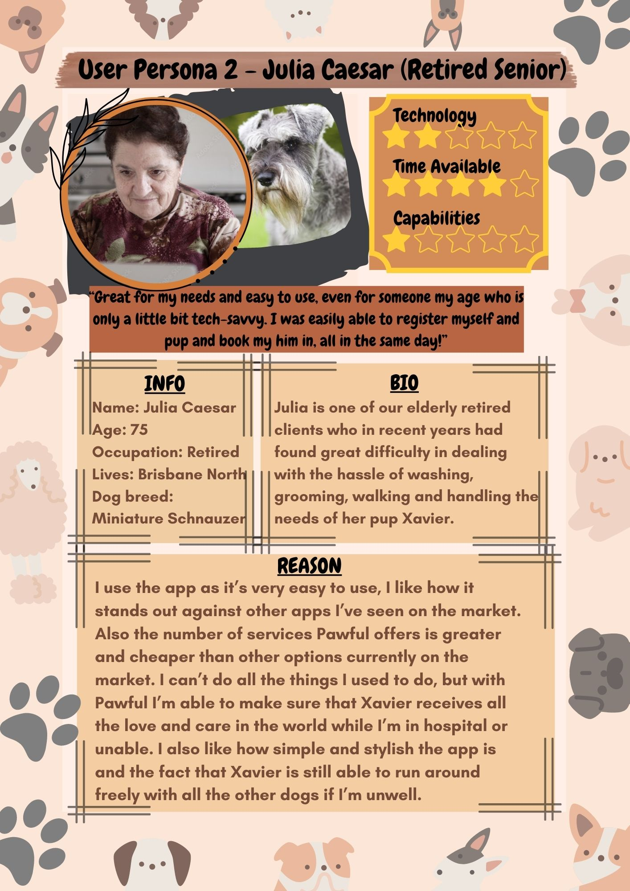

**User Persona 3 - Matthew Ridley (Travelling Entrepreneur)**
-----------

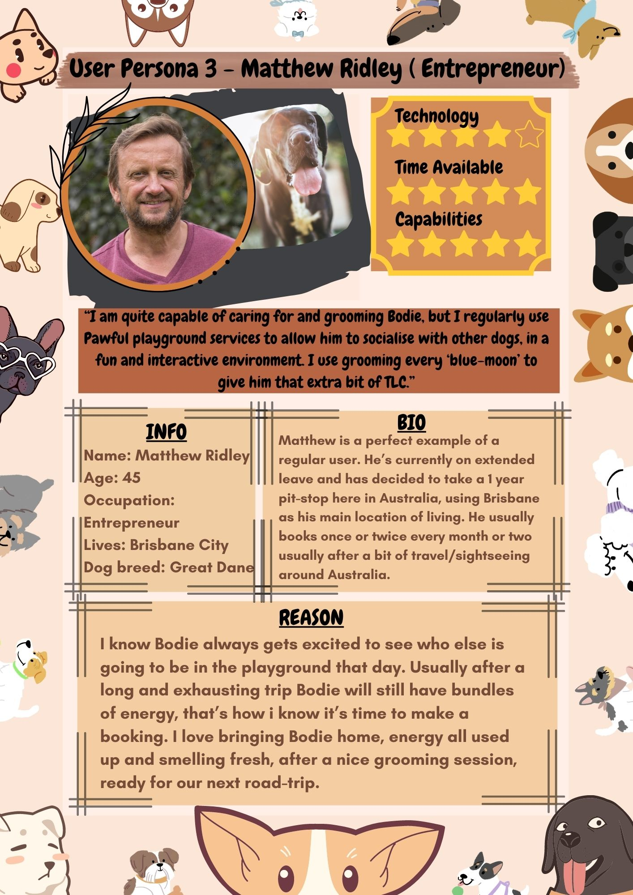

---------------------------------------------------------------------------------------------------------

**Different Views // UI**
-----------

Created to showcase the appearance of the final product's user interface (on all devices) which enables it to reach users on all platforms. This was also used as a template and referenced throughout the application process stages to reflect back and see what it is that we are striving for as a minimum standard for quality. Notice the difference in appearance between desktop and other platforms as we have been able to accommodate for more slender views and still deliver a high-quality functioning product. 

**Mobile View**

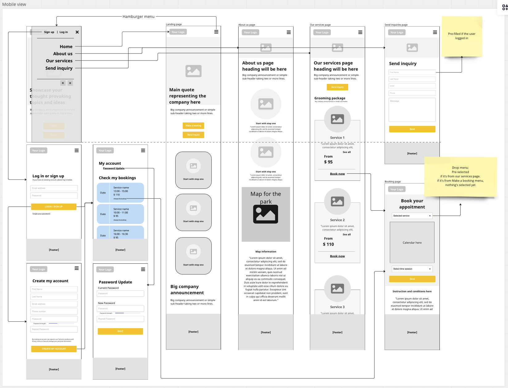

**Tablet View**

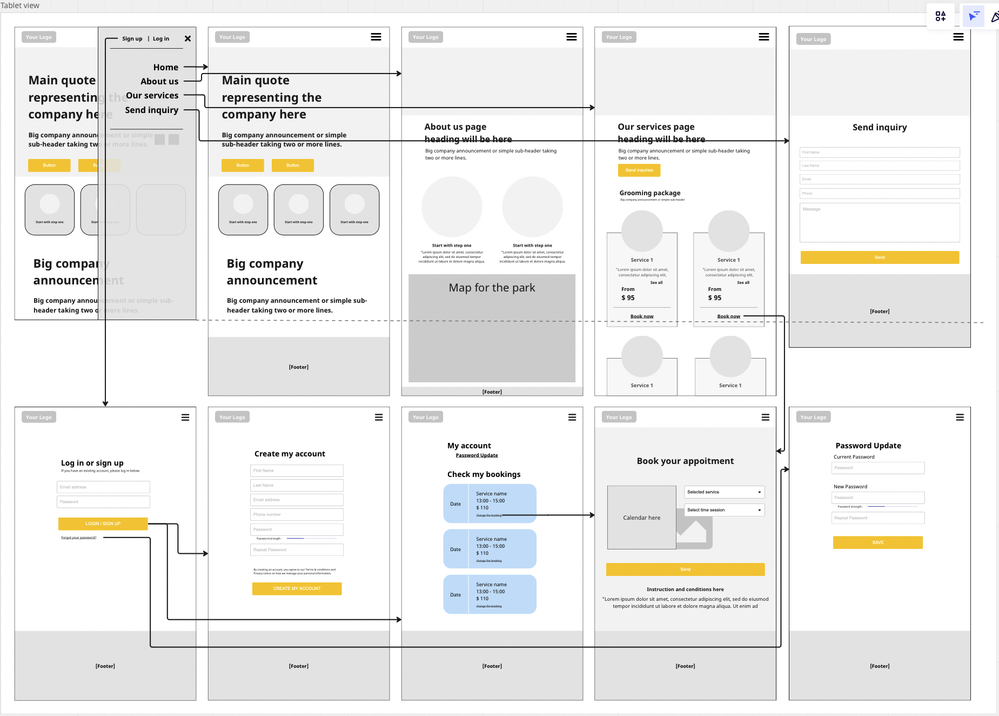

**Desktop View**

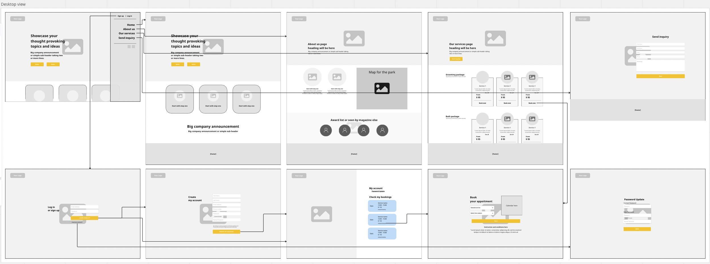

---------------------------------------------------------------------------------------------------------

**Trello ScreenShots**
-----------

Screenshots of our Trello board, starting day 1, which were used to show and document the progress of our project. Trello helped us visualise, as working on a project like this one can become quite abstract and easy to get lost at times. We also used Trello to our advantage of assigning tasks to each team member and maximise productivity, while simultaneously keeping track of our progress which helped to both create and meet deadlines.

**ScreenShot 1**

**ScreenShot 2**
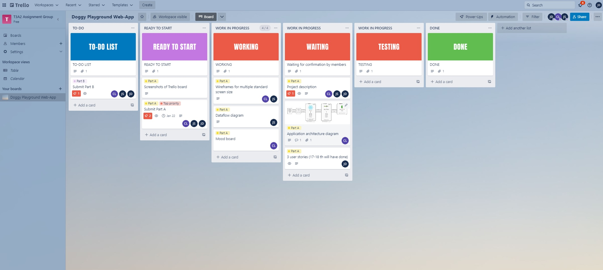

**ScreenShot 3**
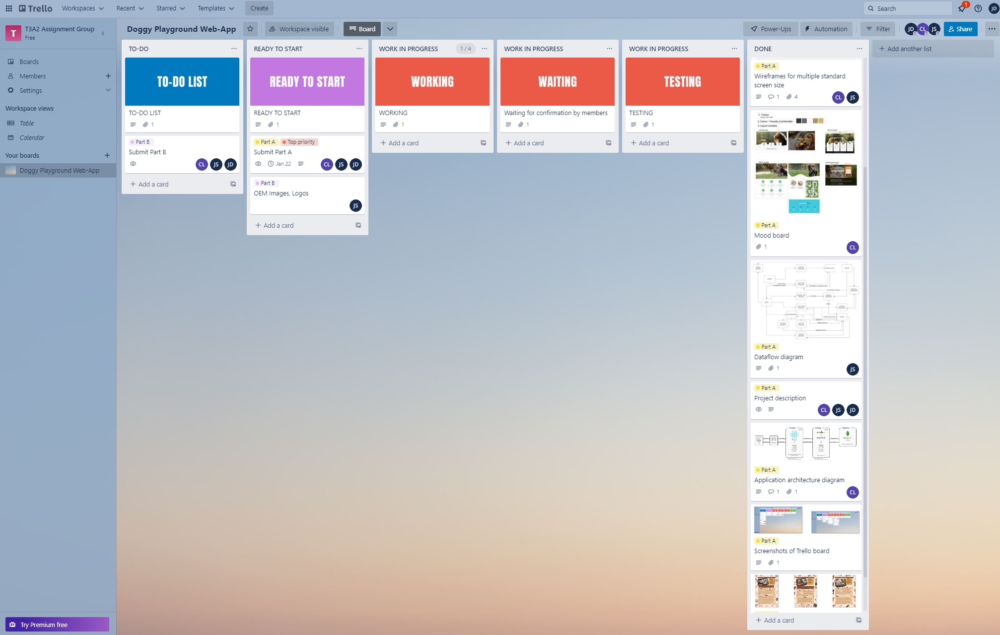